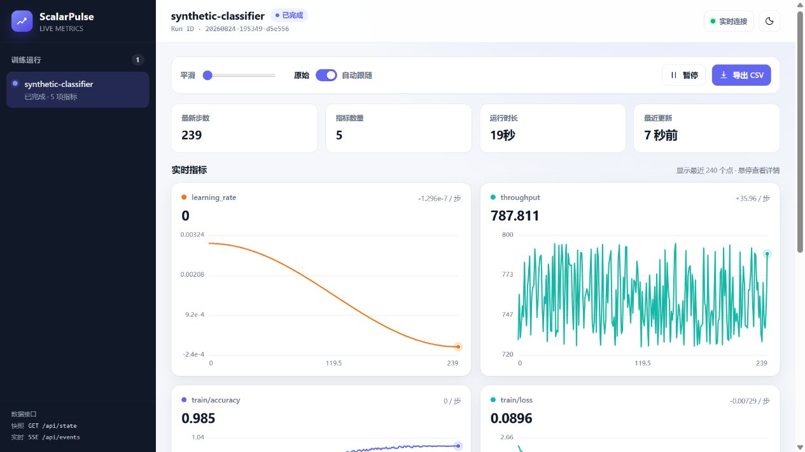

<div align="center">

# ScalarPulse

**A tiny, dependency-free live dashboard for model-training metrics.**

[](https://github.com/lizhengzhong20-sketch/scalarpulse/actions/workflows/tests.yml)
[](https://www.python.org/)
[](LICENSE)
[](#project-status)

[简体中文](README.md)

</div>




ScalarPulse lets you watch loss, accuracy, learning rate, gradient norm, throughput, and any other scalar while a model is training. It stores runs as readable JSONL files and streams updates to a local browser dashboard over SSE.

## Why ScalarPulse?

- **Small by design** — the core package has zero third-party runtime dependencies.
- **Framework independent** — use it with PyTorch, scikit-learn, XGBoost, custom NumPy code, or any loop that can report numbers.
- **PyTorch friendly** — log tensor scalars, optimizer learning rates, and global gradient norm with a small helper.
- **Live and local** — no account, cloud service, or telemetry is required.
- **Useful after training** — reopen historical runs, smooth curves, pause live updates, and export CSV.

## Quick start

Install the current GitHub version:

```bash
python -m pip install "git+https://github.com/lizhengzhong20-sketch/scalarpulse.git"
scalarpulse demo --open
```

Then open the address printed in the terminal, normally `http://127.0.0.1:8765`.

> **Pre-release note:** For now, this documentation recommends installing the current version directly from this repository.

## Add it to a training loop

```python
import scalarpulse

run = scalarpulse.init(
    project="mnist",
    name="cnn-baseline",
    config={"batch_size": 64, "learning_rate": 3e-4},
    open_browser=True,
)

for step in range(1_000):
    loss = train_one_step()
    accuracy = evaluate_if_needed()

    run.log(
        {
            "train": {"loss": loss, "accuracy": accuracy},
            "learning_rate": optimizer.param_groups[0]["lr"],
        },
        step=step,
    )

run.finish()
```

Nested dictionaries become paths such as `train/loss` and `train/accuracy`. Python numbers, NumPy scalars, and single-value PyTorch tensors are accepted. Non-scalar and non-finite values are rejected before they reach the log file.

## PyTorch helper

```python
import scalarpulse
from scalarpulse.torch import TorchLogger

run = scalarpulse.init(project="cifar10", framework="pytorch")
logger = TorchLogger(
    run,
    model=model,
    optimizer=optimizer,
    track_grad_norm=True,
)

for step, (images, targets) in enumerate(loader):
    optimizer.zero_grad()
    logits = model(images)
    loss = criterion(logits, targets)
    loss.backward()

    # Log before zero_grad() so this step's gradients are still available.
    logger.log(
        loss=loss,
        metrics={"accuracy": accuracy(logits, targets)},
        step=step,
    )
    optimizer.step()

run.finish()
```

`scalarpulse.torch` uses duck typing and never imports PyTorch itself, so PyTorch remains optional.

## What can it track?

Any scalar series can be logged, regardless of the algorithm:

- supervised learning: loss, accuracy, precision, recall, F1, AUC;
- regression: MSE, MAE, R²;
- clustering: inertia, silhouette score, cluster counts;
- optimization: objective value, learning rate, gradient norm;
- systems metrics: step time, throughput, memory, or custom counters.

ScalarPulse does not train models or replace an ML framework. It observes the values your code reports.

## Long-running jobs

For long jobs, keep the dashboard in a separate process:

```bash
scalarpulse serve --log-dir ./runs --open
```

```python
run = scalarpulse.init(
    log_dir="./runs",
    launch=False,
    project="experiment",
)
```

The dashboard can then stay available if the training process restarts or fails.

## Command line

```text
scalarpulse serve [--log-dir DIR] [--host HOST] [--port PORT] [--open]
scalarpulse demo  [--steps N] [--interval SECONDS] [same server options]
```

## Data format

Each run is an independent directory:

```text
.scalarpulse/
└── 20260824-161500-a1b2c3/
    ├── meta.json
    └── metrics.jsonl
```

One JSONL line represents one `log()` call. The format is append-friendly, human-readable, and straightforward to load into pandas. A damaged trailing line is ignored while reading.

## Security

ScalarPulse listens on `127.0.0.1` by default and has no authentication. Do not expose it directly to an untrusted network. If you bind to `0.0.0.0`, place it behind an authenticated reverse proxy or use it only on a trusted network. Values passed in `config` are stored locally and are visible through the dashboard API, so never put passwords or tokens there.

See [SECURITY.md](SECURITY.md) for details.

## Project status

ScalarPulse is an alpha-quality local scalar dashboard. It does not yet provide cloud sync, distributed multi-process aggregation, multi-run overlay comparison, image or histogram logging, authentication, artifact storage, or large-scale log indexing. TensorBoard and hosted experiment platforms remain better choices when those capabilities are required.

## Development

```bash
git clone https://github.com/lizhengzhong20-sketch/scalarpulse.git
cd scalarpulse
python -m pip install -e ".[dev]"
python -m pytest
python -m build
```

Contributions are welcome. See [CONTRIBUTING.md](CONTRIBUTING.md), open a bug report, or propose a feature.

## License

[MIT](LICENSE)
